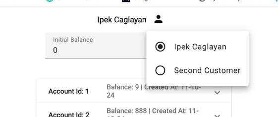
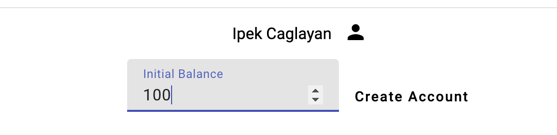
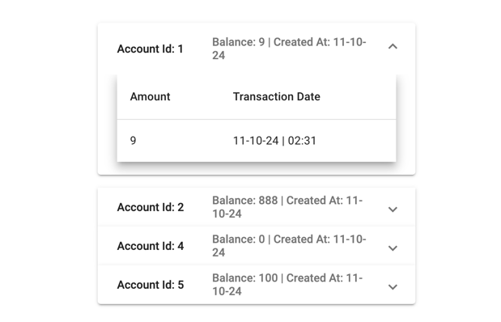

# customer-account-manager

This project consists of two backend services developed with Spring Boot and a user interface built with Angular. The
AccountManager service is responsible for creating new accounts for existing users, while the TransactionManager service
handles the creation of transactions associated with these accounts, including an initial credit. These two distinct
services communicate with each other using Kafka.

When a new account is created, a Kafka message containing the newly generated account ID and initial credit is sent. The
TransactionManager listens to the same Kafka topic, so when it receives a message from the AccountManager, it triggers
the creation of a transaction for the newly created account. The user interface is simply
designed to provide an easy testing environment.

# Technologies Used


* [Spring Boot](https://docs.spring.io/spring-boot/index.html)
* [Apache Kafka](https://kafka.apache.org/)
* [Docker](https://www.docker.com/)
* [Swagger](https://swagger.io/)
* [Angular](https://angular.dev/overview)
* [Angular Material](https://material.angular.io/)


# System Requirements
This application requires Docker to be installed, as all services and dependencies run within containers.

# Running the Application

1. Clone the repo
   ```sh
   git clone https://github.com/ipekcaglayan/customer-account-manager.git
   ```
2. Navigate to the project directory
   ```sh
   cd customer-account-manager
   
   ```
3. Navigate to the local-development directory
   ```sh
   cd local-development
   ```
4. Start the Application with Docker Compose
   ```sh
   docker compose up --build
   ```
5. Once the application is up and running, navigate to http://localhost:4200/ in your web browser.
   ```sh
   http://localhost:4200/
   ``` 

# Application Screenshots

### Switching Between Customers 


### Creating an Account for Selected Customer 


### Accessing Account and Transaction Details 

